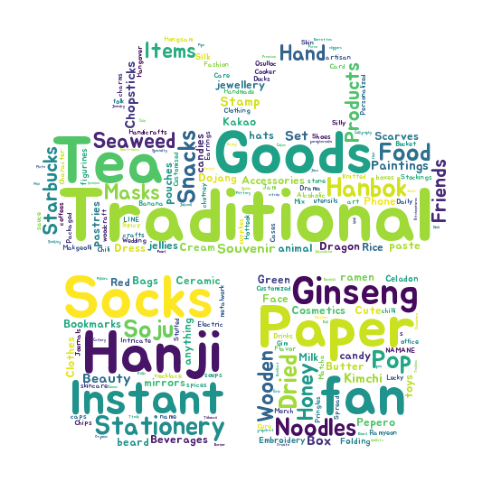
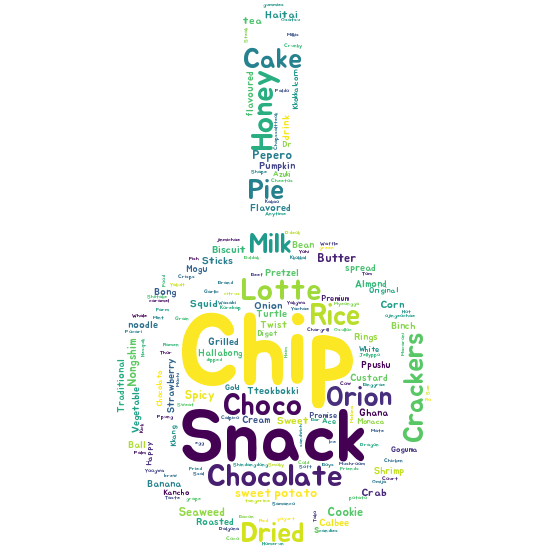

# 🚢 Adios Team First_Project (팀 프로젝트)

## 🎯 부산항 입항 외국인 선원 대상 마케팅 인사이트 제공
- 선용품 구매플랫폼 구축을 위한 데이터 분석 및 시각화
- 외국인 선원 체류 시간별 관광코스 정보 제공

### 📅 프로젝트 기간
- 2024/02/27 ~ 03/05

### 👥 R&R (Role and Responsibility)
- 데이터 수집
- 데이터 가공
- 시각화(워드클라우드, 공실데이터)
- 상관분석

### 🛠️ 사용언어 및 라이브러리
- **언어**: Python
- **라이브러리**: [requirements.txt](requirements.txt)

### 🗂️ 총활용 데이터
- **링크**: [데이터별 링크](데이터별%20링크.xlsx)

## 🌟 서비스 기능
1. 부산항만공사에게 선용품 구매플랫폼 구축을 위한 데이터 제공
2. 체류 시간별 부산 관광코스 정보 제공 서비스

## 🎯 서비스 타겟
1. 부산항만공사
2. 외국인 선원

## 📊 프로젝트 수행 내용

### 1️⃣ 선용품 구매플랫폼 구축(1): 물동량과 체류시간의 연관분석을 통한 선용품 구매플랫폼 서비스의 니즈 파악
- **활용 데이터**:
  1. [부산항 물동량 추이](https://www.busanpa.com/kor/Contents.do?mCode=MN0931)
  2. [체류시간](https://www.pnitl.com/infoservice/vessel/vslScheduleList.jsp)
- **활용 용도**: 상관관계 분석
- **코드 링크**: [물동량-체류시간 상관관계 분석](상관분석/물동량-체류시간_상관분석_zscore표준화.ipynb)

### 2️⃣ 선용품 구매플랫폼 구축(2): 외국인 선호 선용품을 추리기 위한 년도별, 분기별 선호 품목 분석
- **활용 데이터**: [관세청_전국 및 부산권항 선용품 무역통계](https://www.data.go.kr/data/15060293/fileData.do)
- **활용 용도**: 선용품 선호 품목 분석 시각화
- **코드 링크**: [년도별 분기별 선용품 선호 품목 분석](년도별%20분기별%20품목%20분석/년도별%20분기별%20품목별%20분석.ipynb)

### 3️⃣ 선용품 구매플랫폼 구축(3): 외국인 선호 선용품 분석을 통한 워드클라우드 시각화
- **활용 데이터**: 외국인 선호하는 선용품에 대한 해당 품목 영어로 검색 후, 관련 도메인 사이트 크롤링
- **활용 용도**: 외국인 선호 선용품 워드클라우드 시각화
- **코드 링크**:
  1. [부산 기념품 크롤링&워드클라우드](크롤링&워드클라우드/기념품%20크롤링%20and%20워드클라우드.ipynb)
  2. [부산 특산 음식 크롤링&워드클라우드](크롤링&워드클라우드/식품%20크롤링%20and%20워드클라우드.ipynb)

  
부산 기념품 워드클라우드

  

  
부산 특산 음식 워드클라우드

  

### 4️⃣ 선용품 구매플랫폼 구축(4): 선용품 보관창고 위치 분석
- **활용 데이터**: 네이버 부동산 웹크롤링을 통한 부산신항만 기준으로 10~20분 내 거리에 위치한 상가· 업무· 공장· 토지
- **활용 용도**: 선용품 보관 및 수령장소 관련한 창고리스트의 시각화
- **코드 링크**: [공실지도](지도%20시각화/공실지도%20folium%20완성.ipynb)
- **시각화 html**: [시각화](지도%20시각화/공실지도.html)

### 5️⃣ 외국인 추천 관광 코스: 부산 지역 내 맛집, 관광지, 숙박 지도 시각화
- **활용 데이터**: 구글맵 크롤링을 통한 부산신항만 기준으로 10km 이내 맛집, 숙박업소, 관광지(평점 4점 이상)
- **활용 용도**: 선원 체류시간별 관광 코스 추천
- **코드 링크**: [맛집, 관광지, 숙박 지도 시각화](지도%20시각화/맛집,%20관광지.%20숙박%20지도%20시각화(folium).ipynb)

## 🔍 중점 사항
- WBS 상시 확인: 과업별 진도 파악을 통한 기한 내 프로젝트 완성에 주력 [WBS](부산항만공사%20직영%20서비스플랫폼%20구축을%20위한%20데이터분석%20WBS.xlsx)
- 코드 컨벤션 기반 코딩 주력: 생산성 향상 및 코드 인계간 빠른 의사결정으로 과업 진행 [코드컨벤션](데이터분석_코드컨벤션_0.1.pptx.pdf)
- 도메인 및 메타데이터 파악: 무역 프로세스와 프로세스 간 발생되는 데이터 의미 파악을 통한 신속한 데이터 수집/가공/시각화
- 직접 코딩 지향:
  1. Excel '다운로드' 버튼을 통한 데이터 수집 지양
  2. Selenium, BeautifulSoup 등을 활용한 직접 코딩 및 전처리를 통한 코딩 스킬 극대화
- 주 사용자, 즉 고객 입장에서의 서비스/기능 정의 및 구현에 주력
- 과업별 후 코드 리뷰: 단계별 코드 공유를 통한 효율적인 코딩 스킬 학습 및 적용

## 📝 미흡 사항
- 코드컨벤션 기반의 코딩 습관 부족
- 서비스가 목적이 아니라 점점 분석이 목적이 되어버리는 상황 발생

## 📂 산출물 
- 🌐 스트림릿: [스트림릿 링크](https://busanportservice.streamlit.app/)
- 📄 팀 포트폴리오: [팀 포트폴리오](부산항_데이터분석_ver_1.0_완료.pdf)
- 📊 시각화 자료: [시연영상](Adios_시각화결과산출물.mp4), [물동량 플로우리쉬](플로우리쉬.mp4)

---

💬 **회고**: 국비지원부트캠프에 온 지 약 한 달 만에 하는 프로젝트라 긴장되고 주제를 어떤걸 할지 막막했지만 훌륭한 팀원들 덕분에 
바른 로드맵으로 진행해 와서 막힘없이 진행했던 것 같다. 데이터 전처리와 시각화에 대해서 자신감이 붙었고, 데이터 분석에 대한 흐름을 잘 숙지하게 되었고 파이썬 함수에 대한 응용도도 올라간 짧지만 정말 유익한 시간이었다.