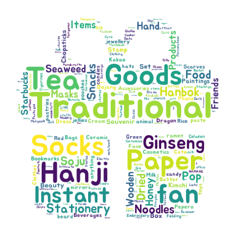
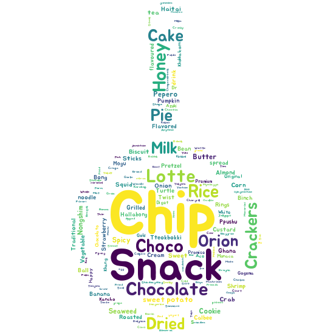

# Busan Port Crew Service & Marketing Insight Analysis


> Korean version: [README_Kver.md](./README_Kver.md)

## Overview

This team project analyzed port logistics, foreign seafarer stay duration, marine supply demand, vacant commercial spaces, and nearby tourism resources around Busan Port. The goal was to provide data-driven insights for building a marine supplies purchasing platform and a stay-duration-based tourism recommendation service for foreign seafarers entering Busan Port.

The project was completed during a data analysis bootcamp and focused on the full data analysis workflow: data collection, preprocessing, exploratory analysis, correlation analysis, web crawling, geospatial visualization, and service-oriented insight generation.

## Project Period

- **Duration:** February 27, 2024 - March 5, 2024
- **Type:** Team project
- **Team:** Adios

## My Role

I contributed mainly to the following areas:

- Data collection through public data sources and web crawling
- Data cleaning and preprocessing
- Correlation analysis between cargo volume and vessel stay duration
- Word cloud visualization for preferred marine supply items
- Geospatial visualization of vacant properties and service-related locations
- Insight generation for a marine supplies platform and tourism recommendation service

## Key Objectives

1. **Validate the demand for a marine supplies purchasing platform**  
   Analyze the relationship between Busan Port cargo volume and foreign vessel stay duration to identify whether increased port activity could support additional services for foreign seafarers.

2. **Identify potential marine supply product categories**  
   Analyze yearly and quarterly marine supply trade data to identify product categories that could be suitable for a purchasing platform.

3. **Explore foreign seafarer-oriented product preferences**  
   Crawl English-language web content related to Korean souvenirs and local foods, then visualize frequent keywords using word clouds.

4. **Support logistics and pickup-location planning**  
   Collect and visualize vacant commercial, office, factory, and land listings located within approximately 10-20 minutes from Busan New Port.

5. **Provide stay-duration-based tourism insights**  
   Visualize restaurants, accommodations, and tourist attractions within a 10 km radius of Busan New Port to support tourism course recommendations for foreign seafarers.

## Tech Stack

- **Language:** Python
- **Data Processing:** pandas, numpy, openpyxl
- **Visualization:** matplotlib, seaborn, plotly, folium, wordcloud
- **Statistical Analysis:** scipy, scikit-learn
- **Web Crawling:** Selenium, BeautifulSoup
- **Geospatial Visualization:** folium, MarkerCluster
- **Deployment / Demo:** Streamlit

See [`requirements.txt`](requirements.txt) for the package list.

## Data Sources

The project used multiple public and crawled data sources, including:

- Busan Port cargo volume statistics
- Busan New Port International Terminal vessel schedule and stay-duration data
- Korea Customs Service marine supplies trade statistics
- Naver Real Estate listings near Busan New Port
- Google Maps data for restaurants, accommodations, and tourist attractions
- English-language web pages related to Korean souvenirs and snacks

A source reference file is available here: [`data-links.xlsx`](data-links.xlsx)

## Main Analysis Workflow

### 1. Correlation Analysis: Cargo Volume vs. Stay Duration

To estimate the potential demand for foreign seafarer services, we analyzed the relationship between Busan Port cargo volume and vessel stay duration.

- **Data used:** Busan Port cargo volume data and vessel stay-duration data
- **Method:** Correlation analysis and standardized comparison using z-score scaling
- **Main insight:** Cargo volume and stay duration showed a positive correlation, supporting the need for additional services targeting foreign seafarers.

Notebook: [`correlation-analysis/cargo-volume-stay-duration-correlation-zscore.ipynb`](correlation-analysis/cargo-volume-stay-duration-correlation-zscore.ipynb)

### 2. Yearly and Quarterly Marine Supply Item Analysis

We analyzed marine supply trade statistics by year and quarter to identify frequently traded and potentially preferred product categories.

- **Data used:** Korea Customs Service marine supplies trade statistics
- **Method:** Yearly and quarterly item-level aggregation and visualization
- **Output:** Product-category trend charts from 2018 to 2023

Notebook: [`yearly-quarterly-item-analysis/yearly-quarterly-marine-supply-item-analysis.ipynb`](yearly-quarterly-item-analysis/yearly-quarterly-marine-supply-item-analysis.ipynb)

### 3. Web Crawling and Word Cloud Visualization

To understand product preferences from an international user perspective, we crawled English-language content related to Korean souvenirs and local food products.

- **Data used:** Crawled English web articles and product recommendation pages
- **Method:** Selenium/BeautifulSoup crawling, keyword extraction, and word cloud visualization
- **Output:** Word clouds for souvenir-related and food-related product keywords

Notebooks:

- [`crawling-wordcloud/souvenir-crawling-wordcloud.ipynb`](crawling-wordcloud/souvenir-crawling-wordcloud.ipynb)
- [`crawling-wordcloud/food-crawling-wordcloud.ipynb`](crawling-wordcloud/food-crawling-wordcloud.ipynb)

<details>
  <summary>Souvenir Word Cloud</summary>
  
</details>

<details>
  <summary>Food Word Cloud</summary>
  
</details>

### 4. Vacant Property Map Visualization

We crawled real estate listings near Busan New Port and visualized vacant commercial spaces that could potentially be used as storage or pickup locations for a marine supplies purchasing platform.

- **Data used:** Naver Real Estate listings around Busan New Port
- **Method:** Web crawling, address/location preprocessing, and folium map visualization
- **Output:** Interactive map of vacant commercial, office, factory, and land listings

Notebook: [`map-visualization/vacant-property-map-folium.ipynb`](map-visualization/vacant-property-map-folium.ipynb)  
HTML Output: [`map-visualization/vacant-property-map.html`](map-visualization/vacant-property-map.html)

### 5. Restaurant, Accommodation, and Tourist Attraction Map

We collected and visualized highly rated restaurants, accommodations, and tourist attractions within a 10 km radius of Busan New Port.

- **Data used:** Google Maps crawling results
- **Criteria:** Locations with a rating of 4.0 or higher
- **Method:** Location-based filtering and folium map visualization
- **Use case:** Stay-duration-based tourism recommendation for foreign seafarers

Notebook: [`map-visualization/restaurant-tourism-accommodation-map-folium.ipynb`](map-visualization/restaurant-tourism-accommodation-map-folium.ipynb)

## Project Deliverables

- **Streamlit Demo:** [Busan Port Service Demo](https://busanportservice.streamlit.app/)
- **Team Portfolio Report:** [`busan-port-data-analysis-report.pdf`](busan-port-data-analysis-report.pdf)
- **Team Presentation:** [`busan-port-data-analysis-presentation.pptx`](busan-port-data-analysis-presentation.pptx)
- **Visualization Demo Video:** [`adios-visualization-demo.mp4`](adios-visualization-demo.mp4)
- **Cargo Volume Visualization Video:** [`flourish-cargo-volume.mp4`](flourish-cargo-volume.mp4)
- **WBS:** [`busan-port-service-platform-wbs.xlsx`](busan-port-service-platform-wbs.xlsx)
- **Code Convention Guide:** [`data-analysis-code-convention.pdf`](data-analysis-code-convention.pdf)

## Repository Structure


```text
first_project/
├── README.md
├── README_Kver.md
├── requirements.txt
├── data-links.xlsx
├── correlation-analysis/
│   └── cargo-volume-stay-duration-correlation-zscore.ipynb
├── yearly-quarterly-item-analysis/
│   ├── yearly-quarterly-marine-supply-item-analysis.ipynb
│   ├── 2018-quarterly-marine-supply-items.png
│   ├── 2019-marine-supply-items.png
│   ├── 2020-marine-supply-items.png
│   ├── 2021-marine-supply-items.png
│   ├── 2022-marine-supply-items.png
│   └── 2023-marine-supply-items.png
├── crawling-wordcloud/
│   ├── souvenir-crawling-wordcloud.ipynb
│   ├── food-crawling-wordcloud.ipynb
│   ├── souvenir.png
│   └── food.png
├── map-visualization/
│   ├── vacant-property-map-folium.ipynb
│   ├── vacant-property-map.html
│   └── restaurant-tourism-accommodation-map-folium.ipynb
├── busan-port-data-analysis-report.pdf
├── busan-port-data-analysis-presentation.pptx
├── data-analysis-code-convention.pdf
├── busan-port-service-platform-wbs.xlsx
├── adios-visualization-demo.mp4
└── flourish-cargo-volume.mp4
```

## What I Learned

This was one of my first end-to-end data analysis projects during the bootcamp. Through this project, I gained hands-on experience in collecting real-world data, cleaning and transforming datasets, validating a business hypothesis with correlation analysis, and turning analysis outputs into service-oriented insights. I also learned the importance of defining the user and business problem clearly before conducting analysis.

## Retrospective

Although the project was completed within a short period, it helped me understand the overall flow of a data analysis project from planning to insight delivery. One improvement point was that the project gradually became analysis-driven rather than service-driven. In future projects, I would define user scenarios and success metrics earlier so that each analysis step is more directly connected to the final product or service decision.
